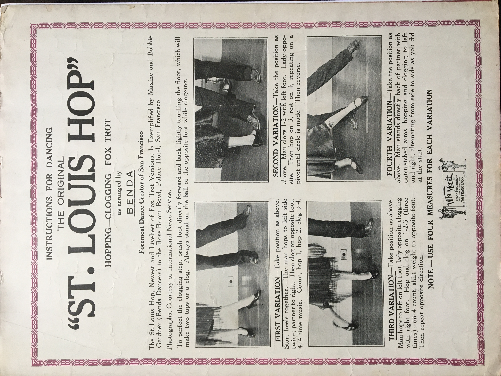

There is magic in performing swing dances in public. Inevitably, some audience members will themselves be dancers, or carry with them the legend of how their parents met dancing in one of the old ballrooms. In 2016 I performed with Jenny Shirar, Jenna Applegarth, and Eddie Rutland at Eden Seminary in St. Louis County for a concert series. After demonstrating several swing dance styles, including St. Louis Shag, two members of the audience approached me. They introduced themselves as Vernon and Marge Wagner and recalled their dancing years at the Casa Loma Ballroom. Then Vernon told me that they used to call St. Louis Shag the "Hop Toddle." The obscure term enchanted me, and this interaction remained vivid in my memory.

As revealed to me in period newspapers, the Hop Toddle, also known locally as Finale Hop and Flea Hop, was a St. Louis-based variant of partnered Charleston and inspired a popular dance called the St. Louis Hop. These dances, with names faded like beer ads across the city's corridors of brick, tell some of the pre-history of Shag in St. Louis.

#### The Larger Story: African-American Artists Set New Standards in Popular Dance Through the Texas Tommy and the Charleston

Shag and adjacent swing dances are rooted within the African-American vernacular jazz idiom. Music critic Albert Murray states, "Blues-idiom dance movement being always a matter of elegance is necessarily a matter of getting oneself together," and that its distinctive character is a "unique combination of spontaneity, improvisation, and control." In this context dancing involves, among many things, a steady rhythm, a dynamic relationship with the audience, and a social dance context that includes "rituals of resilience and perseverance through improvisation in the face of capricious disjuncture."

Most primary sources cited in this article come from white newspapers where the context of this idiom is lost or distorted. Indeed, many white ballroom instructors framed Black dances as needing to be "refined" or "modified" in subservience to Euro-centric dance conventions. I aim to contextualize these expressions so as not to perpetuate them. One challenge is that relevant archival records of the primary Black newspaper in this city, the St. Louis Argus, were destroyed by a fire. Acknowledging the wider context of Black dance innovations rising to the national stage in the early 1900s can help to offset distortions and illuminate "new" jazz-era dances as being part of a longstanding continuum.

**The Texas Tommy**

 The story of the sensational Texas Tommy dance, which bridged the ragtime and early jazz eras, provides some key context around emergent jazz- and -swing-era dances throughout the United States. The Texas Tommy has eponymic origins but was made famous in Black dance halls along the Barbary Coast in San Francisco sometime in the first decade of the 20th century. Broadway impresario Florence Ziegfield's interest in showcasing the dance in New York arose out of excitement around San Francisco's appointment to hold the next world exposition. Between 1912 and 1913 Mary Dewson, Ethel Williams, and Johnny Peters were among the Black artists who showcased the up-tempo Texas Tommy in major cities, helping to encase such rigorous rhythmic propulsion and death-defying control of centripetal force on which future partner dances would be based. As Williams recalled, “. . . there were two basic steps--a kick and hop three times on each foot, and then add whatever you want, turning, pulling, sliding.” She also drew a clear connection between the Texas Tommy and the Lindy Hop.

As an exhibition dance, the Texas Tommy rivaled dances which traveled in a counter-clockwise line-of-dance and gave enthusiasm for new "spot" dances that favored rhythmic complexity and individual expression over a partnership's spatial position on the floor. The Texas Tommy dance reflected a synthesis of African-derived rhythmic sophistication and European-derived music harmony as a recent American musical standard: ragtime, pioneered by Black Americans in the Central United States.

**The Charleston**

In 1923 American popular dancing forever changed when musician James P. Johnson and choreographer Elida Webb staged the Charleston, a dance imported to New York City by the Geechee people of the Carolinas, in the Broadway Show Runnin' Wild. Whether identified by its stage name or presented anonymously through dozens of variations and extensions, the Charleston bridged the jazz and swing eras, and has remained a perennial touchstone in Black vernacular dances.

This brief but critical background establishes that every following dance trend discussed--namely the family of pre-Shag dances during the 1920s and 30s--is derived from Black-American dance forms, which stylized both African- and European-derived dance conventions in new ways. During this time tens of thousands of Black people migrated from Southern states to St. Louis in search of economic, familial, educational, and artistic opportunities. Dances, of course, migrated too.

#### The Finale Hop and Hop Toddle of St. Louis

“Innovations consist of the Friday night ‘finale’ and ‘toddle hop’ dance competitions that are soon to displace the Charleston if they have not already done so,” reported the St. Louis Globe Democrat in mid-June 1926 from St. Louis's largest open-air dance floor at the Forest Park Highlands amusement park.

The trend of the Toddle Hop, or Hop Toddle, began more than a decade before the term "Shag" was widely used outside of the Carolinas, and primary sources suggest that it was a sibling of the earlier Finale Hop, a dance named after the Finale Hoppers of Brooklyn who were said to have bounced from the last songs of one dance hall to the next to avoid entrance fees. While "toddle," stepping with an on-beat bounce, and "hop" were general terms for dancing to jazz music, evidence suggests that the Hop Toddle was an identifiable stylization of partnered Charleston in St. Louis.

 In September 1926 an advertisement for the Arcadia Ballroom's dancing school announced, “Learn the ‘Valencia’ and new ‘St. Louis Hop Toddle.'" At the same time, the Black-owned Booker T. Washington Theatre hosted a weekly juvenile Charleston contest, and brought to St. Louis the latest dances and songs circulating the Theater Owners Booking Association (TOBA) entertainment circuit. Ballrooms, dance schools, and theaters facilitated a constant exchange of national and local dance trends--an endless game of terpsichorean telephone.

A City-wide championship in Finale Hop was held in the final months of 1926 at local movie theaters with music by Gene Rodemich, the leading white jazz band leader in the region. Prize money and salaried dance positions were awarded to contest winners, elevating the competition and serving to funnel Black dance forms into segregated white spaces. 

In Alton, Illinois, a river town about twenty miles north of St. Louis, dancers shared a competitive bent for dancing and participated in finale hop prize contests as late as 1933. An H.A. Stecker told the Alton News Telegraph in 1968, “I came along first at the end of ragtime when jazz was first born and the one step, foxtrot, and hesitation waltz brought on a new breed, 'The Old Smoothies.' Then came the Charleston and the hop toddle followed by the rhumba, tango, and the cha cha. I did them all.” This account reveals, along with my interaction with the Wagners, that Hop Toddle, tethered to the Charleston, remained in the dance consciousness of the St. Louis region decades after the jazz and swing eras.

#### St. Louis Hop: "A Dance That is Supposed to Have Originated in St. Louis"

In July 1926 The Metropolitan Theater in Los Angeles was staging performances and contests featuring a "new dance craze," conducted by banjo extraordinaire Eddie Peabody. As leading performer Clarice Ganon stated,

'The St. Louis hop' . . . is a dance that is supposed to have originated in St. Louis. It is taking the place of the Charleston. It is a mixture of the Negro shuffle and the Charleston. The hop is danced to a syncopated rhythm double the time of the Charleston. There is lots of movement in it. Folks who are not fast with their feet are advised to shun it.

(White dancers used the term "Negro shuffle" previously to describe both the Foxtrot and Charleston when those dances were new to activate a white racial lens of exoticism, not to describe a tactile dance movement). Once again, a dance marketed as a threat to the Charleston proved instead that the reign of the Charleston endured.

Dance historian Forrest Outman first relayed to me that Finale Hop may have evolved into St. Louis Hop, and indeed, a July 1927 letter to the editor in the St. Louis Post-Dispatch says, “Los Angeles was overwhelmed with the ‘St. Louis Hop,’ a dance which originated in this little old town of ours and is better known here as the ‘Finale Hop.’ This dance took hold of Los Angeles as strong as the Charleston took the country and was all the rage out on the coast.” The writer closes with a wistful prayer for Congress to “put the Hops back in our once world-famous breweries.”

St. Louis Hop was documented in writing. The sheet music for "The Original St. Louis Hop - Flea Hop or Fox Trot" includes instructions sung to the melody of the song: "Hop to the left, twice on your left foot while your right foot's clogging--Then do the same thing to the right, clog with the left," and "After a hop you do a kick but keep your partner clogging--Feet crossed until you change or decide to stop." The last page of the sheet music shows the feet of a dance team executing further variations and positions, "as arranged by Benda," a classical stage dancer in San Francisco, with enigmatic and contradictory written instructions. Regardless, the central hopping and clogging steps echo the Texas Tommy and coheres with other late 1920s partnered dances that incorporated tap dance elements and emphasized athleticism and speed.  

In Betty Lee's Dancing: All the Latest Steps (1927) Lee describes another version of St. Louis Hop with basic footwork as all slow steps (taking two beats each), starting with four toddling steps (walking with a bounce), followed by four step-hops, upon which one can add leg swings to the sides and forward and back. Lee also directs partners to turn in unison while doing this footwork. These shapes resemble closed-position Collegiate Shag more than St. Louis Shag.

These two published instructions of the dance share little in common, and to speculate on their connection to the Hop Toddle and Finale Hop championed on the floor of the Forest Park Highlands is to daydream. What the publications do illustrate is that St. Louis Hop became a buzzword that allowed studio owners and ballroom instructors to keep cashing in on the popularity of the Charleston and its derivatives.

#### Flea Hop: The Shag of the 1920s?

For contemporary Lindy Hop dancers, "Flea Hop'' often describes a six-count rhythm that features step-stomps, a kind of ghost of the pre-swing era Flea Hop, which was likely another byword for up-tempo jazz dancing. Dance historians such as Lance Benishek and Peter Loggins have cited the mysterious Flea Hop as a precursor to the styles that became known as Collegiate Shag.

A few years after the obsession with Finale Hop and St. Louis Hop, two St. Louis ballroom instructors made remarks linking the dances to Flea Hop, which stands as a qualifier in the subtitle of the "The Original St. Louis Hop" song. In 1930 local ballroom instructor Ann Clark recounted a trip she took to Los Angeles where after seeing Eddie Peabody perform she read an announcement for an upcoming St. Louis Hop contest: "My California friends couldn't understand that I, a dancing teacher, had not the slightest idea what the widely advertised St. Louis Hop was. Needless to say, I was in the first row the day the contest opened and you can imagine my surprise when I found the St. Louis hop no other than the flea hop which had originated in our own ballroom."

Harry Trimp, another ballroom instructor, recalled that after the Charleston, “New steps were constantly in demand, and the next dance to run riot in St. Louis was the hop toddle. This was a hop with a redowa step and eventually developed into the flea hop, which was extremely popular.”

In the same breaths, Trimp confessed that young people, not ballroom instructors, set dance trends, further revealing that Finale Hop, Hop Toddle, or St. Louis Hop as dances named and marketed were flavors of the broader lived reality of people who danced, as Albert Murray says, "to meet the basic requirements of the workaday world."

When another dance known as "The Shag" radiated outward from the Carolinas with the Big Apple craze in 1937, that term took on a larger meaning and joined the ranks of the Texas Tommy, Lindy Hop, and Charleston--dances difficult to describe, but easy to recognize. What preceded the naming or packaging of these dances was a public demand for dance beat-oriented music and an endless stream of on-beat hops, kicks, scuffs, turns, and crossovers passed down and improvised on the continuum of Black-American vernacular dance.

As the 1930s waned Shag in St. Louis congealed into a system of side-by-side basics, kick-aways, fall-off-the-logs, front-to-back sliding doors, whatever stomps and kicks pleased the dancers, and whatever extensions the partners felt could spellbind competitors and audiences.

#### Acknowledgements

Big thanks to Latasha Barnes and Jenny Shirar for reviewing early drafts and providing necessary insights.

#### Works Referenced

Murray, Albert. Stomping the Blues. University of Minnesota Press, 2017

Malone, Jacqui. Steppin' on the Blues: The Visible Rhythms of African American Dance. University of Illinois, 1996.

Stearns, Jean and Marshall. Jazz Dance: The Story of American Vernacular Dance. Da Capo Press, 1994.

Strickland, Rebecca, R. The Texas Tommy, Its History, Controversies, and Influence on American Vernacular Dance. Florida State University, 2006.

Lee, Betty. All the Latest Steps. 1927.

Robinson, Russell and George Wagner. Original St. Louis Hop Flea Hop or Foxtrot sheet music. Villa Moret, San Francisco, 1926.

Newspapers referenced: St. Louis Globe Democrat, St. Louis Post-Dispatch, St. Louis Star Times, Alton News Telegraph, Los Angeles Daily News.

