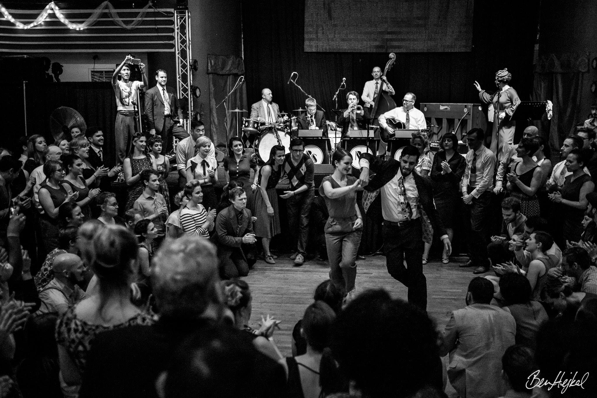

Welcome to a new website dedicated to the education, history, and preservation of the dance St. Louis Shag, an up-tempo partnered swing dance that emerged in St. Louis, Missouri, United States during the mid-1930s.

Jam Circle at Nevermore Jazz Ball 2016 - Photo by Ben Hejkal
 

Taking inspiration from the website http://collegiateshag.com/ we intend stlouisshag.com to be a virtual resource to help new dancers who would like to learn the dance to experienced dancers and teachers who are looking to deepen their understanding of the history and cultural context of the dance.
